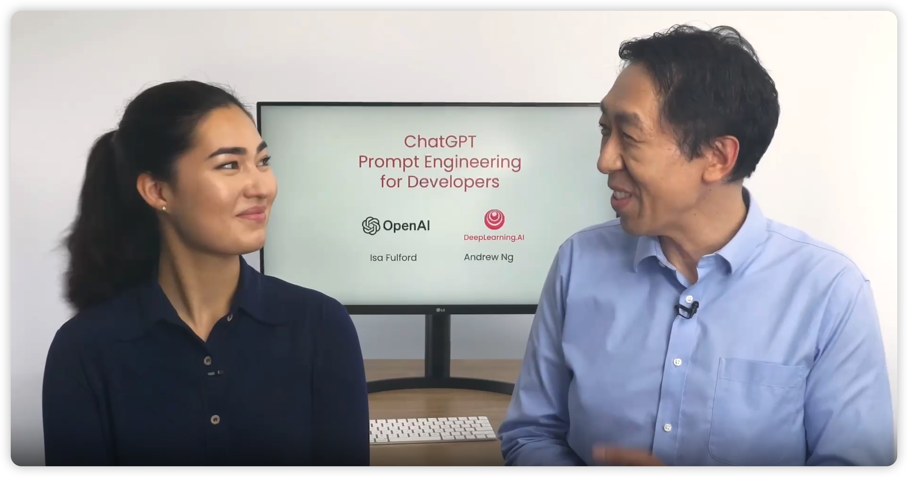
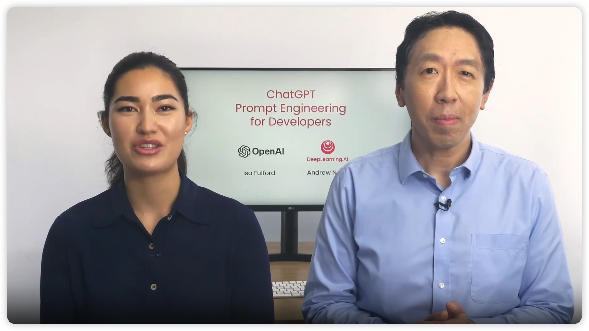
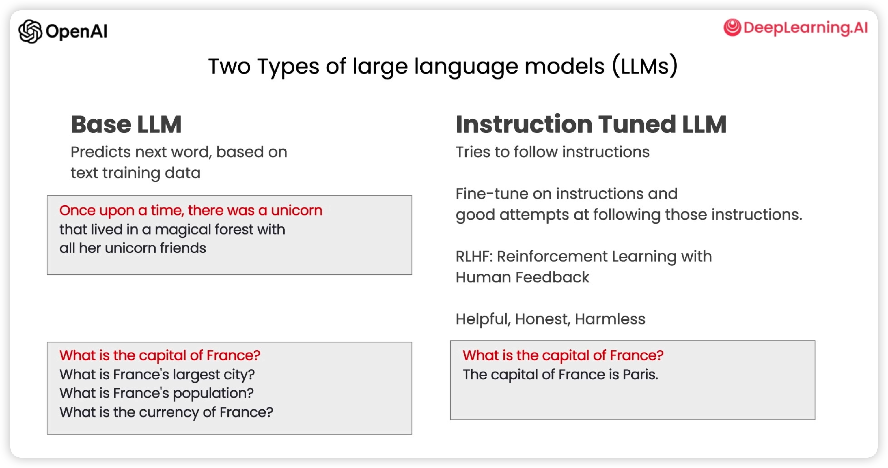
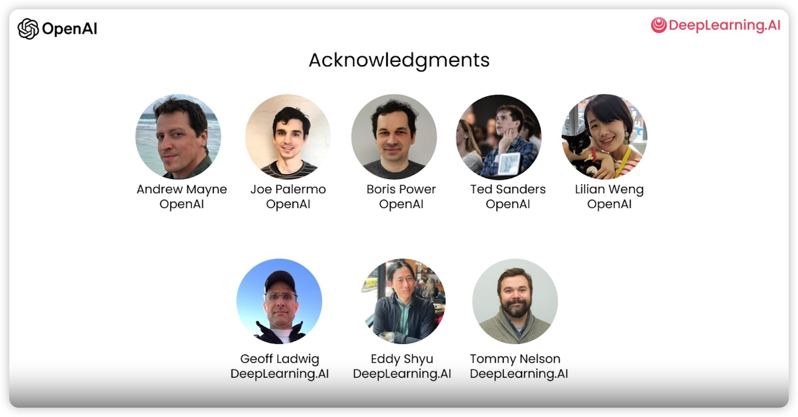

[ChatGPT Prompt Engineering for Developers](https://learn.deeplearning.ai/chatgpt-prompt-eng/lesson/1/introduction) 是吴恩达老师和 OpenAI Isa Fulford 老师合作的一门课程，主要介绍了如何使用 GPT-3 的 API 来构建聊天机器人，以及如何使用 GPT-3 的 API 来完成一些常见的任务，比如总结(summarizing)、推断(inferring)、转换(transforming)、扩展(expanding)等等。

对于如何使用,还是推荐大家去[ChatGPT Prompt Engineering for Developers](https://learn.deeplearning.ai/chatgpt-prompt-eng/lesson/1/introduction) 提供的环境实操一下，这里只是对该课程的一些笔记和总结。仅供参考,如有错误,欢迎指正,提 PR 修复。

# Introduction(引言)

欢迎来到这门面向开发人员的 ChatGPT 提示工程课程。 我很高兴有 Isa Fulford 和我一起教这个。她是 OpenAI 的技术人员，构建了流行的 ChatGPT 检索插件，她很大一部分工作一直在教人们如何在产品中使用 LLM 或大型语言模型技术。她还为教人们 prompting 的 OpenAI cookbook 做出了贡献。 很高兴能和你在一起。 我很高兴来到这里与大家分享一些有启发性的最佳实践。

互联网上已经有很多关于 prompting 的材料，比如每个人都必须知道的 30 个prompt的文章，其中很多都集中在 ChatGPT 的网络用户界面上，许多人都用它来做一些具体的、经常是一次性的任务。但我认为 LLM 大型语言模型,作为开发人员的强大之处在于使用对 LLM 的 API 调用来快速构建软件应用程序。

事实上,我认为这仍然被低估了. 我在 AI Fund 的团队是 DeepLearning.AI 的姊妹公司。它一直在与许多初创公司合作，将这些技术应用于许多不同的应用程序并且很高兴看到 LLM API 可以让开发人员快速构建.因此，在本课程中，我们将与您分享一些您可以做什么的可能性以及如何做这些事情的最佳实践。本教程有很多材料要涵盖。

首先，您将学习一些促进软件开发的最佳实践然后我们将介绍一些常见的用例(cases)，总结(summarizing)、推断(inferring)、转换(transforming)、扩展(expanding)然后您将使用 LLM 构建一个聊天机器人.我们希望这会激发您对可以构建的新应用程序的想象力,

因此，在大型语言模型或 LLM 的开发中，大致有两种类型的 LLM，我将它们称为基础 LLM(base LLMs) 和指令调优 LLM(instruction tuned LLMs), base LLMs 已经过训练，可以根据文本训练数据预测下一个词 通常根据来自互联网和其他来源的大量数据进行训练 找出下一个最有可能出现的词是什么,

因此，举例来说，如果你要提示这句话“从前有一只独角兽”，它可能会完成这个，即它可能会预测接下来的几个词是：和所有的独角兽朋友住在一个神奇的森林里

但是如果你要提示这个:法国的首都是什么然后根据什么文章在互联网上可能有很有可能 base LLMs 将通过什么是法国最大的城市，法国的人口是多少等等. 因为互联网上的文章很有可能是关于法国国家的问答题列表(关于法国的问答题)
相比之下，一个指令调优 LLM(instruction tuned LLMs)、 它也是 LLMs 研究和实践的一大动力所在. LLM(instruction tuned LLMs)已经被训练得能够听从指令。因此，如果你问它，法国的首都是什么？它可能会输出类似: 法国的首都是巴黎的信息

因此，通常训练指令调优 LLM 的方式是 您从一个基础 LLM 开始，该基础 LLM 经过大量文本数据的训练，然后进一步训练它以使用作为指令的输入和输出对其进行微调，并尝试遵循这些指令指示
然后经常使用称为 RLHF(reinforcement learning from human feedback) 的技术进一步完善, 使系统能够更好地提供帮助并遵循指示.因为指令调整的 LLMs 已经被训练成有帮助的、诚实的和无害的.

因此，例如，他们不太可能输出有问题的文本，例如与基础 LLM 相比有毒的输出(toxic outputs)很多实际的使用场景已经转向了指令调整的 LLMs.你在互联网上找到的一些最佳实践可能更适合于的 base LLMs
但对于今天的大多数实际应用，我们会建议大多数人专注于指令调整的 LLMs, 它更容易使用, 同时也让 OpenAI 和其他 LLM 公司的工作成为更安全、更一致.所以本课程将着重于指令调整的 LLMs 最佳实践

我想感谢 OpenAI 和 DeepLearning.ai 的团队 这对 Izzy 和我将要展示的材料做出了贡献。 我非常感谢 Andrew Main，Joe Palermo，来自 OpenAI 的 Boris Power、Ted Sanders 和 Lillian Weng 他们积极参与我们的头脑风暴材料、审查为这个短片整理课程的材料.我也很感谢深度学习 Geoff Ladwig、Eddy Shyu 和 Tommy Nelson .

因此，当你使用调整过的 LLM 的指令时，请想一想,给另一个人的指令。他是一个聪明但不知道你的任务细节的人。
所以，当一个 LLMs 不工作时，有时是因为指令不够清楚。

例如，如果你说，请给我写一些关于艾伦图灵(Alan Turing) 此外，从清楚地角度来说,知道你是否希望文本集中在他的科学工作或他的个人生活或他在历史上的作用或其他方面，这可能是有帮助的，如果你指定你希望文本的语气是什么，它应该采取像专业记者会写的语气？还是说它更像一个随意的说明 希望 OMS 产生你想要的东西？

当然，如果你想像自己要求，比方说，一个刚毕业的大学毕业生为你完成这项任务 如果你甚至可以指定他们应该提前阅读哪些文本片段来写这篇关于艾伦图灵(Alan Turing)的文章 那么这就更好了 那个成功的大学毕业生为你完成这个任务
所以在下一个视频中，你会看到如何清晰和具体的例子，这是提示 OMS 的一个重要原则, 你还可以从提示的第二个原则中学习 给 LLM 思考的时间 所以，让我们继续看下一个视频

### 省流版本

男主是鼎鼎大名的吴恩达,女主是来自 OpenAI 的 Isa Fulford. 他俩要讲 prompting 的最佳实践. prompting 指的是 LLM(Large Language Models,大型语言模型)中输入的提示词.

LLM 大致有两种类型的 LLM: 基础 LLM(base LLMs) 和指令调优 LLM(instruction tuned LLMs):

-   **基础 LLM 功能**: 你输入前面部分机器补充后面部分. 比如你输入:`从前有一只独角兽`, 机器会提示: `和所有的独角兽朋友住在一个神奇的森林里`. 连起来就是: `从前有一只独角兽和所有的独角兽朋友住在一个神奇的森林里`

-   **指令调优 LLM**: 为问答式的功能, 它是在基础 LLM 上经过大量文本数据的训练,同时使用称为 RLHF(reinforcement learning from human feedback) 的技术进一步完善(主要是裁剪有害输出).

本教程的侧重点是讲指令调优 LLM
