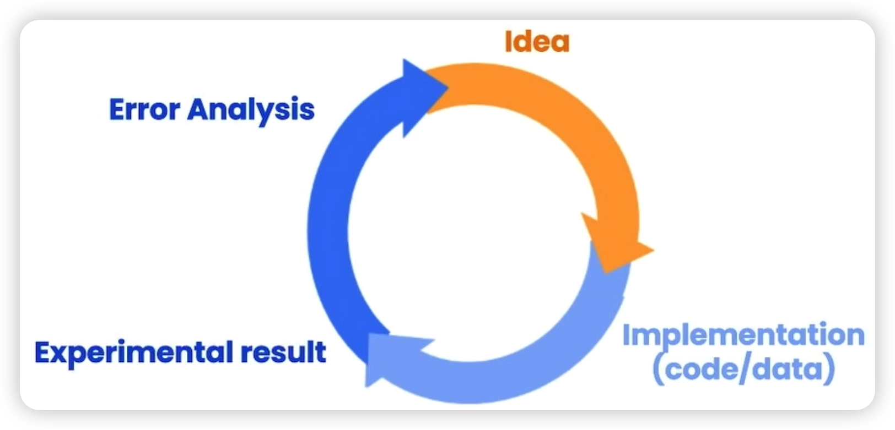
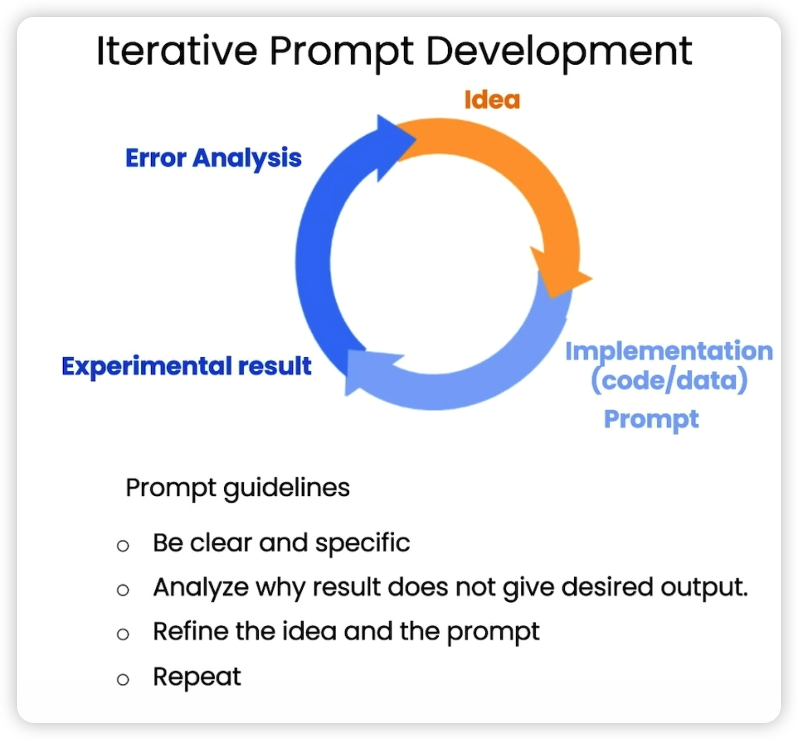

# Iterative(迭代)

本节吴恩达老师讲到写prompting和机器学习有点像,第一次成功的概率非常低,要不断的迭代更新.

<center style="font-size:14px;color:#C0C0C0;text-decoration:underline">机器学习过程</center> 


<center style="font-size:14px;color:#C0C0C0;text-decoration:underline">写prompting过程</center> 


接下来做一个实验: 拿一个椅子的产品说明书,生成各种文案

## Generate a marketing product description from a product fact sheet(从产品说明书生成营销产品描述)

````python
fact_sheet_chair = """
OVERVIEW
- Part of a beautiful family of mid-century inspired office furniture, 
including filing cabinets, desks, bookcases, meeting tables, and more.
- Several options of shell color and base finishes.
- Available with plastic back and front upholstery (SWC-100) 
or full upholstery (SWC-110) in 10 fabric and 6 leather options.
- Base finish options are: stainless steel, matte black, 
gloss white, or chrome.
- Chair is available with or without armrests.
- Suitable for home or business settings.
- Qualified for contract use.

CONSTRUCTION
- 5-wheel plastic coated aluminum base.
- Pneumatic chair adjust for easy raise/lower action.

DIMENSIONS
- WIDTH 53 CM | 20.87”
- DEPTH 51 CM | 20.08”
- HEIGHT 80 CM | 31.50”
- SEAT HEIGHT 44 CM | 17.32”
- SEAT DEPTH 41 CM | 16.14”

OPTIONS
- Soft or hard-floor caster options.
- Two choices of seat foam densities: 
 medium (1.8 lb/ft3) or high (2.8 lb/ft3)
- Armless or 8 position PU armrests 

MATERIALS
SHELL BASE GLIDER
- Cast Aluminum with modified nylon PA6/PA66 coating.
- Shell thickness: 10 mm.
SEAT
- HD36 foam

COUNTRY OF ORIGIN
- Italy
"""

prompt = f"""
Your task is to help a marketing team create a 
description for a retail website of a product based 
on a technical fact sheet.

Write a product description based on the information 
provided in the technical specifications delimited by 
triple backticks.

Technical specifications: ```{fact_sheet_chair}```
"""
response = get_completion(prompt)
print(response)
````
打印结果:
```
Introducing our stunning mid-century inspired office chair, the perfect addition to any home or business setting. Part of a beautiful family of office furniture, including filing cabinets, desks, bookcases, meeting tables, and more, this chair is available in several options of shell color and base finishes to suit your style. Choose from plastic back and front upholstery (SWC-100) or full upholstery (SWC-110) in 10 fabric and 6 leather options.

The chair is constructed with a 5-wheel plastic coated aluminum base and features a pneumatic chair adjust for easy raise/lower action. It is available with or without armrests and is qualified for contract use. The base finish options are stainless steel, matte black, gloss white, or chrome.

Measuring at a width of 53 cm, depth of 51 cm, and height of 80 cm, with a seat height of 44 cm and seat depth of 41 cm, this chair is designed for ultimate comfort. You can also choose between soft or hard-floor caster options and two choices of seat foam densities: medium (1.8 lb/ft3) or high (2.8 lb/ft3). The armrests are available in either an armless or 8 position PU option.

The materials used in the construction of this chair are of the highest quality. The shell base glider is made of cast aluminum with modified nylon PA6/PA66 coating and has a shell thickness of 10 mm. The seat is made of HD36 foam, ensuring maximum comfort and durability.

This chair is made in Italy and is the perfect combination of style and functionality. Upgrade your workspace with our mid-century inspired office chair today!
```

> 吴恩达老师认为描述太长, 所以希望简短一点

## Issue 1: The text is too long(文字太长)
- Limit the number of words/sentences/characters(限制单词/句子/字符的数量。)

于是prompt增加描述: `Use at most 50 words.`

````python
prompt = f"""
Your task is to help a marketing team create a 
description for a retail website of a product based 
on a technical fact sheet.

Write a product description based on the information 
provided in the technical specifications delimited by 
triple backticks.

Use at most 50 words.

Technical specifications: ```{fact_sheet_chair}```
"""
response = get_completion(prompt)
print(response)

````
返回结果:
```
Introducing our mid-century inspired office chair, perfect for home or business settings. Available in a range of shell colors and base finishes, with or without armrests. Choose from 10 fabric and 6 leather options for full or plastic upholstery. With a 5-wheel base and pneumatic chair adjust, it's both stylish and functional. Made in Italy.
```

> 结果确实减少了很多,同时强调了,我们加了50个单词的限制, 但是返回结果应该可能是40多,60都有可能, 但是这个结果是可以接受的

## Issue 2. Text focuses on the wrong details(文本聚焦于错误的细节)
- Ask it to focus on the aspects that are relevant to the intended audience.(让它专注于与目标受众相关的方面。)

> 希望返回更多关于椅子的技术细节和材料,用于经销商文案, 给prompt增加精确的关于技术细节的描述

增加描述:
```js
The description is intended for furniture retailers, 
so should be technical in nature and focus on the 
materials the product is constructed from.
```
于是prompt更新为:
````python
prompt = f"""
Your task is to help a marketing team create a 
description for a retail website of a product based 
on a technical fact sheet.

Write a product description based on the information 
provided in the technical specifications delimited by 
triple backticks.

The description is intended for furniture retailers, 
so should be technical in nature and focus on the 
materials the product is constructed from.

Use at most 50 words.

Technical specifications: ```{fact_sheet_chair}```
"""
response = get_completion(prompt)
print(response)
````
返回结果:
```
Introducing our mid-century inspired office chair, perfect for both home and business settings. With a range of shell colors and base finishes, including stainless steel and matte black, this chair is available with or without armrests. The 5-wheel plastic coated aluminum base and pneumatic chair adjust make it easy to move and adjust to your desired height. Made with high-quality materials, including a cast aluminum shell and HD36 foam seat, this chair is built to last.
```
从结果上看,返回了更多关于材料上的说明

> 希望返回产品ID

增加描述:
```js
At the end of the description, include every 7-character 
Product ID in the technical specification.
```
于是prompt更新为:
````python
prompt = f"""
Your task is to help a marketing team create a 
description for a retail website of a product based 
on a technical fact sheet.

Write a product description based on the information 
provided in the technical specifications delimited by 
triple backticks.

The description is intended for furniture retailers, 
so should be technical in nature and focus on the 
materials the product is constructed from.

At the end of the description, include every 7-character 
Product ID in the technical specification.

Use at most 50 words.

Technical specifications: ```{fact_sheet_chair}```
"""
response = get_completion(prompt)
print(response)
````
返回结果:
```
Introducing our mid-century inspired office chair, perfect for home or business settings. With a range of shell colors and base finishes, and the option of plastic or full upholstery in various fabrics and leathers, this chair is both stylish and versatile. Constructed with a 5-wheel plastic coated aluminum base and pneumatic chair adjust, it's also practical. Available with or without armrests and suitable for contract use. Product IDs: SWC-100, SWC-110.
```
从结果上看,返回了关于ID的描述

## Issue 3. Description needs a table of dimensions(描述需要尺寸表)
- Ask it to extract information and organize it in a table.(让它提取信息并将其整理成表格。)

> 希望它可以生成我们需要的维度数据和返回格式,比如HTML

增加描述:
```js
After the description, include a table that gives the 
product's dimensions. The table should have two columns.
In the first column include the name of the dimension. 
In the second column include the measurements in inches only.

Give the table the title 'Product Dimensions'.

Format everything as HTML that can be used in a website. 
Place the description in a <div> element.
```
返回结果:
```
<div>
<h2>Mid-Century Inspired Office Chair</h2>
<p>Introducing our mid-century inspired office chair, part of a beautiful family of office furniture that includes filing cabinets, desks, bookcases, meeting tables, and more. This chair is available in several options of shell color and base finishes, allowing you to customize it to your liking. You can choose between plastic back and front upholstery or full upholstery in 10 fabric and 6 leather options. The base finish options are stainless steel, matte black, gloss white, or chrome. The chair is also available with or without armrests, making it suitable for both home and business settings. Plus, it's qualified for contract use, so you can trust its durability and quality.</p>
<h3>Construction</h3>
<p>The chair features a 5-wheel plastic coated aluminum base and a pneumatic chair adjust for easy raise/lower action. You can choose between soft or hard-floor caster options and two choices of seat foam densities: medium (1.8 lb/ft3) or high (2.8 lb/ft3). The chair is also available with armless or 8 position PU armrests.</p>
<h3>Materials</h3>
<p>The shell base glider is made of cast aluminum with modified nylon PA6/PA66 coating, and the shell thickness is 10 mm. The seat is made of HD36 foam, ensuring comfort and support.</p>
<h3>Product Dimensions</h3>
<table>
  <tr>
    <td>Width</td>
    <td>53 cm | 20.87"</td>
  </tr>
  <tr>
    <td>Depth</td>
    <td>51 cm | 20.08"</td>
  </tr>
  <tr>
    <td>Height</td>
    <td>80 cm | 31.50"</td>
  </tr>
  <tr>
    <td>Seat Height</td>
    <td>44 cm | 17.32"</td>
  </tr>
  <tr>
    <td>Seat Depth</td>
    <td>41 cm | 16.14"</td>
  </tr>
</table>
<h3>Product ID</h3>
<p>SWC-100, SWC-110</p>
</div>
```
从结果上看,返回我们需要的维度数据,并返回我们要的HTML格式


## 总结
本节主要是吴恩达老师拿一个椅子的说明书, 通过不断增加描述来生成我们需要的结果.可以说是对上一节Guidelines(指南)的一个实践. 他强调写prompt的过程和机器学习训练的过程一样,需要不断的更新迭代以获得我们期望的结果:
- Be clear and specific
- Analyze why result does not give desired output.
- Refine the idea and the prompt
- Repeat